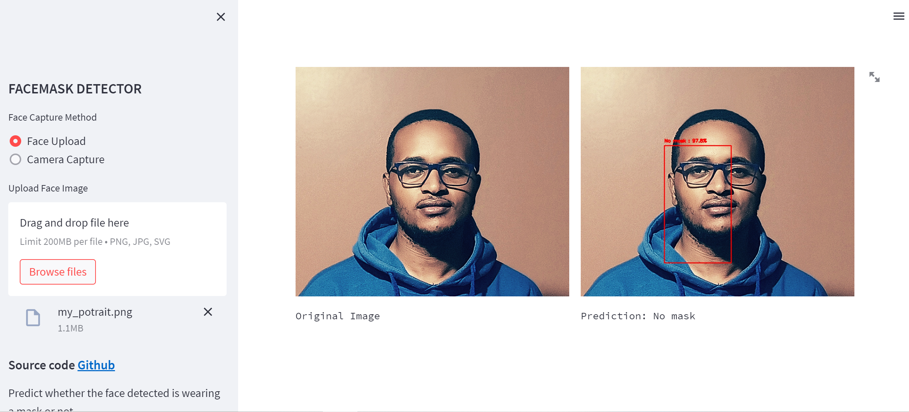
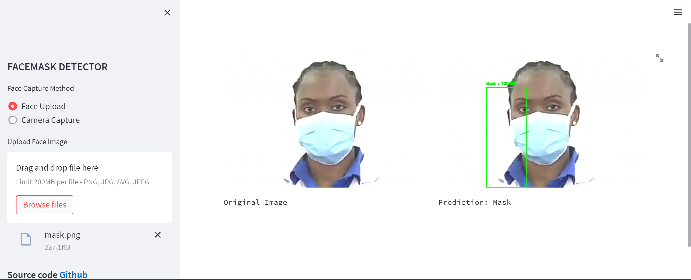
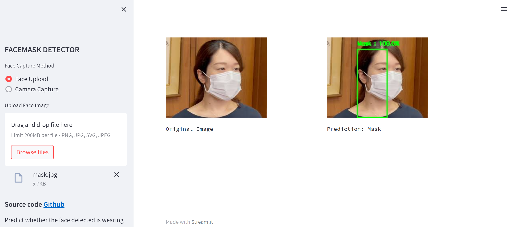

# Facemask Detector

Yes, I know Covid-19 days are now behind us (Thank God) but I built this project to showcase how to build image classification models with  Convolutional Neural Networks and Transfer Learning.

The app is hosted on Streamlit at the [URL](https://www.tensorflow.org)

# Libraries Used

* [Tensorflow](https://www.tensorflow.org/)
* [Numpy](https://numpy.org/)
* [OpenCV](https://docs.opencv.org/4.x/d6/d00/tutorial_py_root.html)
* [Streamlit](https://streamlit.io/)

# Overview of the training Process

* The model is trained on two classes of images, faces with mask and without mask.
* For the pre-trained model (Transfer Learning), I used the VGG16.
* Check out other pretrained models from [keras](https://keras.io/api/applications/).
* I used the VGG16 model only for feature extraction from the images, then I added  fully connected layers for the actual image classification.
* Trained the model over 20 epoch with an Early Stopping Callback which actual stopped the training at 15 epochs.
* The best accuracy on the validation data was 96.66%.
* It's worth noting that I didn't thoroughly test the model with more robust evaluation metrics like precision/recall, that something I hope to do later.

# How the streamlit app works

1. The user uploads or captures an image using their camera.
2. The image is first preprocessed, making it equal in size with the images used in the training.
3. The image then goes though a *res10* facial detector model that detects the face from the image.
4. The detected facial image is taken though the model which generates a prediction.
5. Post process the prediction to generate the prediction label.
6. Create a bounding box for the image, then displays the image on the app with the label of the prediction.

# App Interface

# Notebooks

[Research Notebook](https://github.com/regan-mu/face-mask-detector/tree/main/Notebooks)

# Models

[Facemask Model](https://github.com/regan-mu/face-mask-detector/tree/main/Models)

# Applications

* The model can be embedded into sytems, example in high risk research lab to allow entry only to people with masks on.

# Contribution

* Further improvements can be made to the model, to increase the performance.
* Maybe increase the training data or even a different pretrained model like resNet50.
* Anyone interested in improving the model should feel free to fork it.
